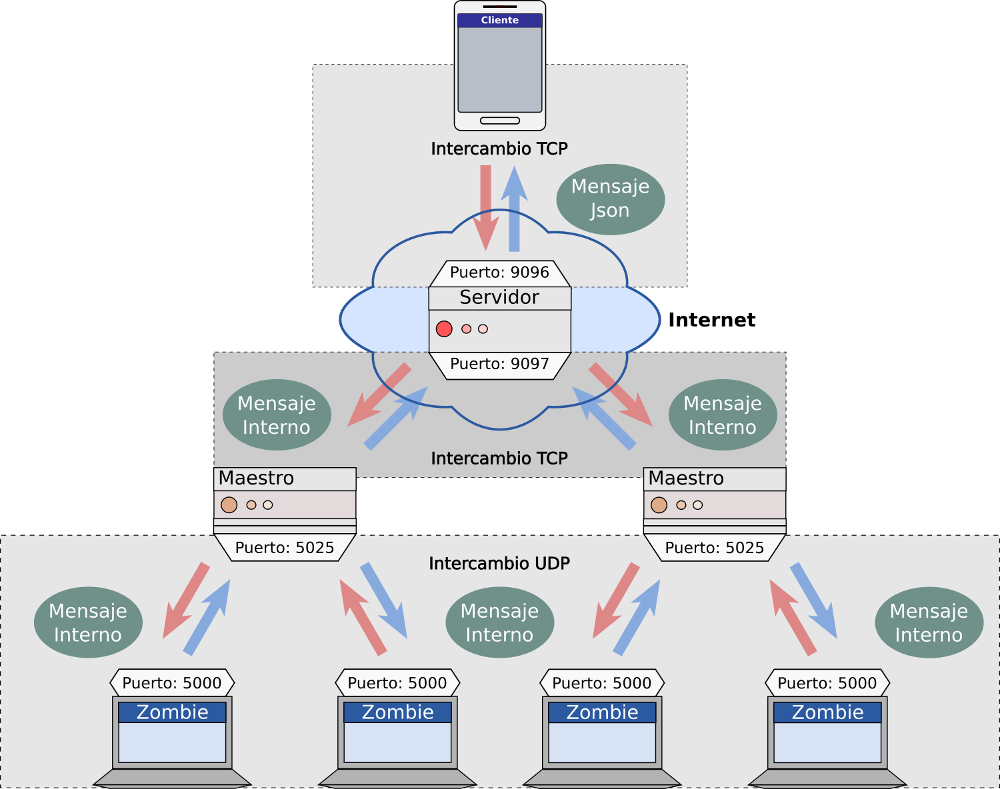

# Sistema básico para una granja de zombis (z500)
*******
<div align="justify">
Este mecanismo sencillo para la gestión de recursos computacionales remotos, se diseñó bajo un modelo de cuatro actores <strong>“1) Zombi, 2) Maestro, 3) Servidor y 4) Cliente”</strong> y, para el control de recursos remotos, implemento tres métodos diferentes <strong>“1) Recuperación de información del Zombi (Host), 2) Escaneo de puertos abiertos en el Zombi (Host) y 3) Barrido de la red del Zombi (Host)”</strong>.
</div>

## Modelo
<div align="justify">
El modelo que comprenden al sistema <strong>“z500”</strong>, describe a cuatro actores diferentes, quienes intervienen en su funcionamiento. Estos actores son:
</div>

<ol>
  <li><div align="justify"><strong>Zombi:</strong> Mecanismo que corre dentro de un Host o equipo de cómputo localizado en una red trasera, sin conexión a internet. Donde, puede ejecutar a alguno de los siguientes métodos:
  </div>
    <ul>
      <li><div align="justify"><i>Recuperación de información del Zombi (Host):</i> Proceso que recupera la “Dirección IP”, “Dirección MAC” y el “Nombre del Host”, del medio que hospeda al Zombi.
      </div></li>
      <li><div align="justify"><i>Escaneo de puertos abiertos en el Zombi (Host):</i> Proceso que consulta los puertos del medio que hospeda al Zombi y entrega como resultado, una lista de los puertos activos.
      </div></li>
      <li><div align="justify"><i>Barrido de la red del Zombi (Host):</i> Proceso que recorrer las diferentes “Direcciones IP” que pueden ser asignadas a los Hosts e Interfaces de la red que hospeda al Zombi, para entregar como resultado, una lista con las “Direcciones IP” asignadas.
      </div></li>
    </ul>
  <div align="justify">
  El Zombi es un mecanismo que solo actuara (es decir, ejecutara algunos de los procesos antes descritos) por petición un Maestro. Ante lo cual, cabe agregar que este mecanismo no es consciente de la existencia de algún Maestro en su red, por lo que, el Zombi constantemente se mantiene a la espera de algún mensaje de BROADCAST – UDP (bajo una Estructura Personal, con instrucciones sobre las acciones que debe realizar).
  </div></li>
  <li><div align="justify"><strong>Maestro:</strong> Mecanismo que corre dentro de un Host con conexión a internet (lugar, en donde se localiza el Servidor) y a una red trasera sin conexión a internet (sitio, en donde se localizan los Zombis). Esto, con la finalidad de comunicar a dos redes diferentes. Ante lo cual, cabe decir que este mecanismo no posee conciencia sobre la existencia de algún Zombi en la red trasera, él asume que existen Zombis, así que comunica por BROADCAST – UDP (bajo una Estructura Personal) instrucciones sobre las acciones que debe realizar cada Zombi.
  </div></li>
  <li><div align="justify"><strong>Servidor:</strong> Mecanismo que controla y distribuye el tráfico entre los Clientes y Maestros, junto a sus Zombis. Ante lo cual, cabe destacar que el Servidor es consciente sobre la existencia de los Maestros, aunque esto lo logra solo hasta que el Maestro inicie una conexión TCP con él y, así, comiencen a intercambiar mensajes bajo una Estructura Personal.
  </div></li>
  <li><div align="justify"><strong>Cliente:</strong> Aplicación de usuario que gestiona las acciones de los Zombis, a través del Servidor (con quien se comunica directamente mediante TCP e intercambiar mensajes en formato Json) y los Maestros conocidos por el mismo Servidor. Por ejemplo, en la carpeta “1_ZomMasterServ” encontramos dos ejemplos de Cliente “4_3_ejemploDeCliente” y “4_4_ejemploDeCliente”, en donde:
  </div>
    <ul>
      <li><div align="justify"><i>4_3_ejemploDeCliente:</i> Solicita a los Zombis presentarse, lo cual, implica que cada Zombi envié información del Host que lo aloja.
      </div></li>
      <li><div align="justify"><i>4_4_ejemploDeCliente:</i> Solicita a los Zombis realizar un escaneo de los puertos abiertos en el Host que los aloja.
      </div></li>
    </ul>
  <div align="justify">
  Además, la carpeta “2_ClienteAndroid” contiene un proyecto de Android referente a una Aplicación para el control de los Zombis y sus acciones.
  </div></li>
</ol>

## Arquitectura del Sistema

<div align="justify">
La arquitectura del sistema <strong>“z500”</strong> suscribe a los cuatro actores descritos por el modelo “Zombi - Maestro - Servidor - Cliente” y ejemplifica el tipo de interacción que existe entre ellos. Esto, como se muestra en la siguiente imagen:
</div>

<br/>

<div align="center">

</div>

<br/>
<br/>

<div align="justify">
Así, cada componente presenta un puerto único para la recepción de mensajes, adscribiendo el siguiente funcionamiento:
</div>

<ul>
  <li><div align="justify"> El Zombi recibe las instrucciones de un Maestro a través del puerto 5000 y el resultado de sus acciones se comunican a su Maestro mediante el puerto 5025.
  </div></li>
  <li><div align="justify"> El Maestro recibe el resultado de las acciones de los Zombis a través puerto 5025 y reenvía la información recibida a un Servidor, quien esperara que estos mensajes sean dirigidos al puerto 9097. También, el Maestro recibe las peticiones de los Clientes, a través de una conexión TCP establecida con el Servidor en el puerto 9096.
  </div></li>
  <li><div align="justify"> El Servidor recibe de los Maestros el resultado de las acciones de los Zombis, a través puerto 9097, y reenvía esta información al Cliente, mediante una conexión TCP entre el Cliente y el Servidor, en el puerto 9096. También, el Servidor redirige a los Maestros las solicitudes de los Clientes, mediante una conexión TCP establecida entre el Cliente y el Servidor, en el puerto 9096.
  </div></li>
  <li><div align="justify"> El Cliente se comunica con el Servidor a través una conexión TCP, dirigida al puerto 9096 del Servidor, mediante la cual, envía solicitudes para que los Zombis ejecuten una acción específica y recibe el resultado de estas solicitudes. 
  </div></li>
</ul>

<div align="justify">
Además, los mensajes intercambiados entre los diferentes componentes de este sistema, como se observó en la imagen anterior, son de dos tipos:
</div>

<ul>
  <li><div align="justify"><strong>Mensaje Interno:</strong> Formato de los mensajes utilizados por el Zombi, Maestro y Servidor, el cual, está definido por una Estructura Personal de 6 parámetros, como se muestra en la siguiente tabla:
  </div></li>
</ul>

|Variable|Tipo|Descripción| 
|------|-----|-----|
|<strong>clave</strong>|int|Indica el tipo de instrucción a ser ejecutada por los Zombis o el Maestro.|
|<strong>xIP</strong>|struct in_addr|Indica la dirección IP de algún Zombi conocido.|
|<strong>zIP</strong>|struct in_addr|Indica la dirección IP de algún Maestro conocido.|
|<strong>xMAC</strong>|char [8]|Indica la dirección MAC del Host actual.|
|<strong>xHostN</strong>|char [100]|Indica el nombre del Host actual.|
|<strong>xDatos</strong>|char [2500]|Espacio de información adicional, en específico el resultado de los procesos ejecutados por los Zombis.|

<ul>
  <li><div align="justify"><strong>Mensaje Json:</strong> Formato de los mensajes utilizados por el Servidor y Cliente, definido por 6 parámetros similares a los descritos por la Estructura Personal, como se muestra en el siguiente mensaje JSON:
  </div></li>
</ul>

```js
{
	"clave" : 5,                            // Orden a ejecutar
	"xIP" : "125.150.175.200",              // Dirección IP auxiliar 1
	"zIP" : "100.150.200.250",              // Dirección IP auxiliar 2
	"xMAC" : "ABCDEF",                      // Dirección MAC auxiliar
	"xHostN" : "Nombre del Host",           // Espacio auxiliar para nombre
	"xDatos" : "Información o resultados",  // Espacio auxiliar para datos
}
```

## Requerimientos de ejecución

|Actor|Requisitos mínimos| 
|------|-----|
|<strong>Zombi</strong>|<p>Sistema operativo = Windows o Linux<br/>Memoria RAM >= 512 MB<br/>CPU >= 1.0 GHz</p>|
|<strong>Maestro</strong>|<p>Sistema operativo = Windows o Linux<br/>Memoria RAM >= 512 MB<br/>CPU >= 1.0 GHz<br/>Acceso a internet</p>|
|<strong>Servidor</strong>|<p>Sistema operativo = Windows o Linux<br/>Memoria RAM >= 512 MB<br/>CPU >= 1.0 GHz<br/>Acceso a internet<br/>Dirección IP publica</p>|
|<strong>Clientes de ejemplo</strong>|<p>Sistema operativo = Windows o Linux<br/>Memoria RAM >= 512 MB<br/>CPU >= 1.0 GHz<br/>Acceso a internet</p>|
|<strong>Cliente para Android</strong>|<p>Sistema operativo = Android 5.0 (Lollipop) o superior<br/>Memoria RAM >= 512 MB<br/>CPU >= 1.0 GHz<br/>Acceso a internet</p>|

## Requerimientos de compilación

<div align="justify">
Este sistema fue diseñado con base en cuatro actores (Zombi – Maestro – Servidor – Cliente), cuyo requerimiento para compilar los archivos fuentes, son:
</div>

<ul>
  <li><div align="justify">Para el caso del Zombi, Maestro, Servidor, y los Clientes de ejemplo, de la carpeta “1_ZomMasterServ”, es necesario realizar lo siguiente:
  </div></li>
    <ol>
      <li><div align="justify">Instalar el compilador “GNU GCC Compiler” en la versión 7.4.0 o superior.
      </div></li>
      <li><div align="justify">Descargar el o los archivos “.cpp” a compilarse, de la carpeta “1_ZomMasterServ” junto con la carpeta “zomutils” y su contenido.
      </div></li>
      <li><div align="justify">Para cada archivo “.cpp” a compilarse, desde la consola o terminal, se deberá ejecutar la siguiente instrucción:
        <ul>
          <li><div align="justify">En Windows:
            <ul>
              <li><div align="justify">C:\\...\\...> g++ ARCHIVO.cpp -lpthread -liphlpapi -l ws2_32 -o ARCHIVO.exe
              </div></li>
              <li><div align="justify">Por ejemplo:
                <ul>
                  <li><div align="justify">C:\\...\\...> g++ 1_zombie.cpp -lpthread -liphlpapi -l ws2_32 -o 1_zombie.exe
                  </div></li>
                  <li><div align="justify">C:\...\\...> g++ 2_maestro.cpp -lpthread -liphlpapi -l ws2_32 -o 2_maestro.exe
                  </div></li>
                  <li><div align="justify">C:\\...\\...> g++ 3_servidor.cpp -lpthread -liphlpapi -l ws2_32 -o 3_servidor.exe
                  </div></li>
                  <li><div align="justify">C:\\...\\...> g++ 4_3_ejemploDeCliente.cpp -lpthread -liphlpapi -l ws2_32 -o 4_3_ejemploDeCliente.exe
                  </div></li>
                  <li><div align="justify">C:\\...\\...> g++ 4_4_ejemploDeCliente.cpp -lpthread -liphlpapi -l ws2_32 -o 4_4_ejemploDeCliente.exe
                  </div></li>
                </ul>
              </div></li>
            </ul>
          </div></li>
          <li><div align="justify">En Linux:
            <ul>
              <li><div align="justify">user@Host:/.../...$ g++ ARCHIVO.cpp -lpthread -lm -o ARCHIVO
              </div></li>
              <li><div align="justify">Por ejemplo:
                <ul>
                  <li><div align="justify">user@Host:/.../...$ g++ 1_zombie.cpp -lpthread -lm -o 1_zombieOP
                  </div></li>
                  <li><div align="justify">user@Host:/.../...$ g++ 2_maestro.cpp -lpthread -lm -o 2_maestroOP
                  </div></li>
                  <li><div align="justify">user@Host:/.../...$ g++ 3_servidor.cpp -lpthread -lm -o 3_servidorOP
                  </div></li>
                  <li><div align="justify">user@Host:/.../...$ g++ 4_3_ejemploDeCliente.cpp -lpthread -lm -o 4_3_ejemploDeClienteOP
                  </div></li>
                  <li><div align="justify">user@Host:/.../...$ g++ 4_4_ejemploDeCliente.cpp -lpthread -lm -o 4_4_ejemploDeClienteOP
                  </div></li>
                </ul>
              </div></li>
            </ul>
          </div></li>
        </ul>    
      </div></li>
    </ol>
  <li><div align="justify">Para el caso de la aplicación de Cliente para Android de la carpeta “2_ClienteAndroid”, es necesario lo siguiente:
  </div></li>
    <ol>
      <li><div align="justify">Instalar Android Studio.
      </div></li>
      <li><div align="justify">Descargar la carpeta “2_ClienteAndroid”.
      </div></li>
      <li><div align="justify">Abrir el proyecto “2_ClienteAndroid” con “Android estudio”.
      </div></li>
      <li><div align="justify"> Considerar que este proyecto fue desarrollo con el API 21: Android 5.0 (Lollipop).
      </div></li>
      <li><div align="justify">Compilar el proyecto “2_ClienteAndroid” con las opciones de “Android Studio”.
      </div></li>
    </ol>
</ul>

## Notas para implementación

<div align="justify">
Para implementar este sistema, es importante tomar en cuenta a los siguientes aspectos:
</div>

<ul>
  <li><div align="justify">En “1_ZomMasterServ/2_maestro.cpp” existe el parámetro “host_name” (de tipo char[]), y tiene con fin indicar la dirección IP del Host en donde se encuentra alojado el Servidor.
  </div></li>
  <li><div align="justify">En “1_ZomMasterServ/4_3_ejemploDeCliente.cpp” existe el parámetro “host_name” (de tipo char[]), y tiene con fin indicar la dirección IP del Host en donde se encuentra alojado el Servidor.
  </div></li>
  <li><div align="justify">En “1_ZomMasterServ/4_4_ejemploDeCliente.cpp” existe el parámetro “host_name” (de tipo char[]), y tiene con fin indicar la dirección IP del Host en donde se encuentra alojado el Servidor.
  </div></li>
  <li><div align="justify">En “2_ClienteAndroid/app/src/main/java/z500/proyecto/sora/cliente/Principal.java”, al invocar a la función “Principal.cces.ReconectarWithServer("Dirección IP del Servidor", 9096);” es necesario indicar la dirección IP del Host en donde se encuentra alojado el Servidor, esto a través de su primer parámetro.
  </div></li>
</ul>

## Notas sobre los métodos implementados

<div align="justify">
Finalmente, un aspecto importante a tomar en cuenta es el tipo de mensaje que el Cliente debe enviar al Servidor y el tipo de respuesta que se espera recibir del mismo. En donde, para cada uno de los métodos implementados, los mensajes a enviar y recibir deben tener la siguiente configuración:
</div>

<ul>
  <li><div align="justify"><strong> Recuperación de información del Zombi (Host):</strong> Al solicitar que los Zombis se presenten, por cada uno, en el mensaje a enviar su campo “clave” debe tener el valor “3”, mientras que los otros campos pueden ir vacíos.

```js
{
	"clave" : 3,                   // Orden: Presentarse
	"xIP" : "125.150.175.200",     // Dirección IP del Zombi
	"zIP" : "100.150.200.250",     // Dirección IP del Maestro
	"xMAC" : "",                   // Dirección MAC del Zombi
	"xHostN" : "",                 // Nombre del Host Zombi
  "xDatos" : "",                       // Espacio auxiliar para datos
}
```

  Así, la respuesta del Servidor por cada Zombi, tendrá en el campo “clave” el valor “0”, en el campo “xIP” la dirección IP del Zombi, en el campo “zIP” la dirección IP de su Maestro, en el campo “xMAC” la dirección MAC del Zombi, en el campo “xHostN” el nombre del Host que aloja al Zombi y el campo “xDatos” vacio.

```js
{
	"clave" : 0,                            // Orden: Presentarse
	"xIP" : "125.150.175.200",              // Dirección IP del Zombi
	"zIP" : "100.150.200.250",              // Dirección IP del Maestro
	"xMAC" : "ABCDEF",                      // Dirección MAC del Zombi
	"xHostN" : "Nombre del Host Zombi",     // Nombre del Host Zombi
	"xDatos" : "3_Desocupado",              // Espacio auxiliar para datos
}
```

  </div></li>
  <li><div align="justify"><strong>Escaneo de puertos abiertos en el Zombi (Host):</strong> Al solicitar que los Zombis descubran los puertos activos del Host que los aloja, por cada Zombi, en el mensaje a enviar su campo “clave” debe tener el valor “4”, en el campo “xIP” la dirección IP del Zombi, en el campo “zIP” la dirección IP de su Maestro y los otros campos vacíos.

```js
{
	"clave" : 4,                   // Orden: Descubrir
	"xIP" : "125.150.175.200",     // Dirección IP del Zombi
	"zIP" : "100.150.200.250",     // Dirección IP del Maestro
	"xMAC" : "",                   // Dirección MAC del Zombi
	"xHostN" : "",                 // Nombre del Host Zombi
  "xDatos" : "",                       // Espacio auxiliar para datos
}
```

  Así, la respuesta del Servidor por cada Zombi, tendrá en el campo “clave” el valor “0”, en el campo “xIP” la dirección IP del Zombi, en el campo “zIP” la dirección IP de su Maestro, en el campo “xMAC” la dirección MAC del Zombi, en el campo “xHostN” el nombre del Host que aloja al Zombi y en el campo “xDatos” los puertos activos en el Host que aloja al Zombi.

```js
{
	"clave" : 0,                                  // Orden: Descubrir
	"xIP" : "125.150.175.200",                    // Dirección IP del Zombi
	"zIP" : "100.150.200.250",                    // Dirección IP del Maestro
	"xMAC" : "ABCDEF",                            // Dirección MAC del Zombi
	"xHostN" : "Nombre del Host Zombi",           // Nombre del Host Zombi
	"xDatos" : "4_Puerto1|Puerto2|...|PuertoN",   // Espacio auxiliar para datos
}
```

  </div></li>
  <li><div align="justify"><strong>Barrido de la red del Zombi (Host):</strong> Al solicitar que los Zombis busquen que otras direcciones IP se encuentran asignadas en la red de su Host, por cada Zombi, en el mensaje a enviar su campo “clave” debe tener el valor “5”, en el campo “xIP” la dirección IP del Zombi, en el campo “zIP” la dirección IP de su Maestro y los otros campos vacíos.

```js
{
	"clave" : 5,                   // Orden: Barrer
	"xIP" : "125.150.175.200",     // Dirección IP del Zombi
	"zIP" : "100.150.200.250",     // Dirección IP del Maestro
	"xMAC" : "",                   // Dirección MAC del Zombi
	"xHostN" : "",                 // Nombre del Host Zombi
  "xDatos" : "",                       // Espacio auxiliar para datos
}
```

  Así, la respuesta del Servidor por cada Zombi, tendrá en el campo “clave” el valor “0”, en el campo “xIP” la dirección IP del Zombi, en el campo “zIP” la dirección IP de su Maestro, en el campo “xMAC” la dirección MAC del Zombi, en el campo “xHostN” el nombre del Host que aloja al Zombi y en el campo “xDatos” las direcciones IP activas en la red del Host que aloja a cada Zombi.

```js
{
	"clave" : 0,                          // Orden: Barrer
	"xIP" : "125.150.175.200",            // Dirección IP del Zombi
	"zIP" : "100.150.200.250",            // Dirección IP del Maestro
	"xMAC" : "ABCDEF",                    // Dirección MAC del Zombi
	"xHostN" : "Nombre del Host Zombi",   // Nombre del Host Zombi
	"xDatos" : "5_IP1|IP2|...|IP3",       // Espacio auxiliar para datos
}
```

  </div></li>
</ul>

*******
## Créditos

Sitios a destacar: [OpAdmin, 2018](https://openport.net/windows-port-scanner/) y [RapidJSON](https://rapidjson.org/)

Proyecto z500 desarrollado por *Eduardo Loyo Martínez, Jesús Alberto Rodríguez Hernández, Juan Marcelo Luvián Mendoza, Julián Galván Viveros y Jorge Luis Jácome Domínguez*.

######  Reedición *Jorge Luis Jácome Domínguez* < [Linkedin](https://www.linkedin.com/in/jorge-luis-j%C3%A1come-dom%C3%ADnguez-44294a91/) - [Dibujando](https://dibujando.net/soragefroren) - [Facebook](https://www.facebook.com/SoraGefroren) - [Youtube](https://www.youtube.com/c/SoraGefroren) >
